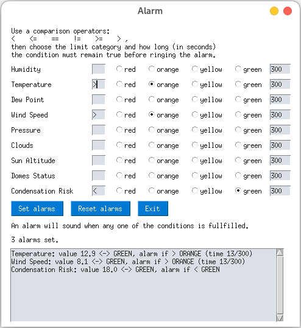

# LaSillaWeatherAlarm

Install the dependencies from `requirements.txt`, then `python3.6+ gui.py`. You should be greeted with what is possibly the best looking GUI of the history of humanity:

Status of the other domes: `green` if all are open, `orange` if any one of them is open, `red` if all closed. Condensation risk: some reasonable condition on the difference between temperature and dew point.
